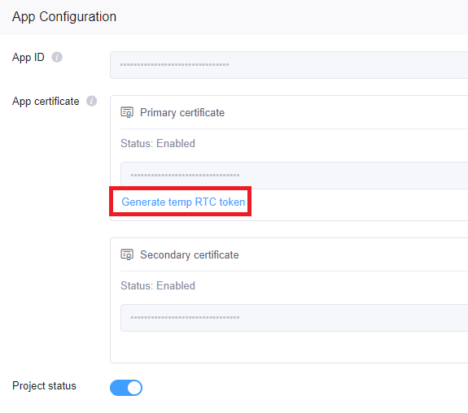
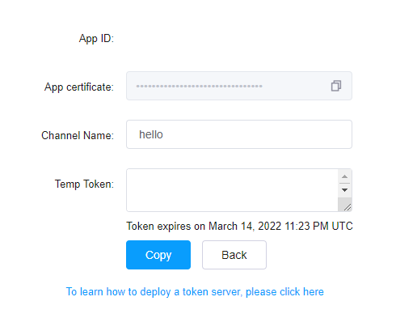
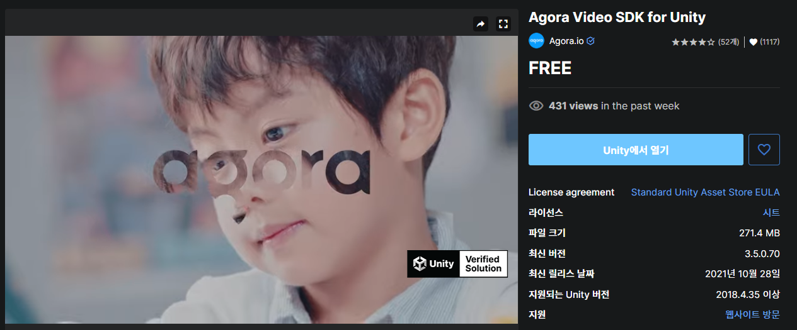
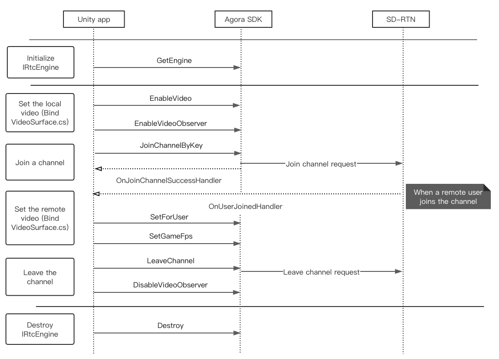

## HelloAgora

Unity 기반으로 Agora Video Call과 화면 공유 샘플 코드에 대한 설명입니다.
화면 공유도 간단하게 구현할 수 있음에도 불구하고 예제가 없어서 작성하고 공개합니다.

1. Agora 프로젝트 생성 
Agora는 사실 굉장히 간단한 SDK 입니다.  
https://console.agora.io/  
에 접속하셔서 프로젝트를 생성하시면 됩니다  
프로젝트 생성을 해주시고 그 다음에 Config에 들어가셔서 Generate temp RTC token을 눌러주시면 됩니다.  

이렇게 나오는데 적당한 channel name을 적어주시고 token을 얻어오시면 됩니다
당연히 카피를 해서 한 곳에 적어두셔야 합니다.
잃어버리더라도 다시 생성해서 사용하면 되니까 상관 없습니다

2. Agora SDK 설치 및 unity project에 import
유티니상에 agora를 import 해서 사용하는 법에 대해서 알아보겠습니다
https://assetstore.unity.com/packages/tools/video/agora-video-sdk-for-unity-134502
에 접속하셔서 Unity에서 열기를 선택한 후에 import 해주시면 됩니다

버튼을 선택한 후에 unity 창에서 열면 아래와 같이 뜨는데 import 버튼을 눌러주면 Video Call을 위한 아고라 SDK 설치및 설정이 끝이 납니다

3. 코드 작성하기 - 기본 Video Call
Agora는 굉장히 심플합니다.
아래의 시퀀스 다이어그램만 이해하고 있으면 손 쉽게 짤수 있습니다.

GetEngine() 함수를 통해서 AgoraEngine을 생성하고 그 뒤에 video 설정을 해줍니다.  
미리 생성해 둔 RawImage에 VideoSurface 속성을 추가해서 자동으로 화면이 뿌려지도록 해줍니다
그 뒤에 JoinChannelByKey를 통해서 channel에 입장을 하게 되면 OnChannelSuccessHandler가 불려지게 됩니다.
혹시 내가 채널에 Join 하였는지 확인하려면 이때 Log Message를 보면 됩니다. 
이렇게 하면 기본적인 비디오 통화가 완성이 되게 됩니다 

4. ScreenShare
void TestRectCrop(int order) 함수를 참고해 주세요
mRtcEngine.StartScreenCaptureByScreenRect() 이 함수만 콜 해주면 됩니다