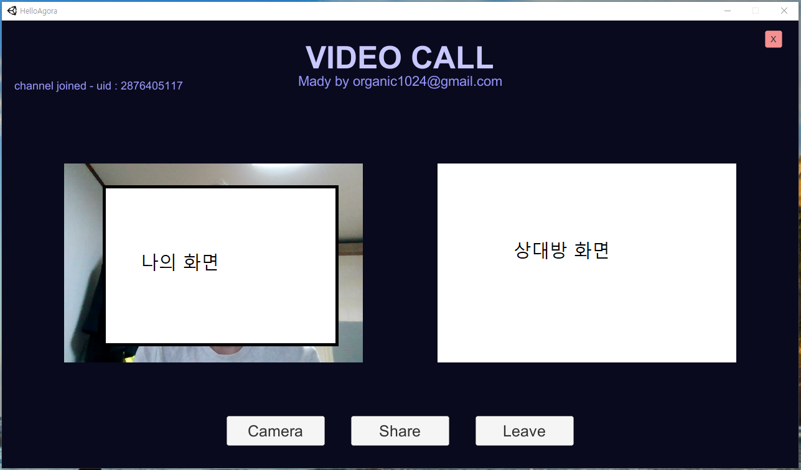

## HelloAgora

Unity 기반으로 Agora Video Call과 화면 공유 샘플 코드에 대한 설명입니다.
작성 앱의 기능에 대해서 설명하겠습니다

1. 자동 접속 (프로그램을 시작하면 자동으로 channel에 join 합니다)  
2. Share 버튼을 누르면 현재 디스플레이의 화면이 공유됩니다.  
3. 다시 Camera를 누르면 나의 카메라로 전환이 됩니다. 이때 화면이 작아집니다
4. Leave 버튼을 누르면 채널에서 떠나게 됩니다.  
5. x 버튼을 누르면 프로그램이 종료 됩니다.  

화면 공유도 간단하게 구현할 수 있음에도 불구하고 예제가 없어서 작성하고 공개합니다.

1. Agora 프로젝트 생성 
Agora는 사실 굉장히 간단한 SDK 입니다.  
https://console.agora.io/  
에 접속하셔서 프로젝트를 생성하시면 됩니다  
프로젝트 생성을 해주시고 그 다음에 Config에 들어가셔서 Generate temp RTC token을 눌러주시면 됩니다.  

이렇게 나오는데 적당한 channel name을 적어주시고 token을 얻어오시면 됩니다.  
당연히 카피를 해서 한 곳에 적어두셔야 합니다.  
하지만 잃어버리더라도 다시 생성해서 사용하면 됩니다.  

2. Agora SDK 설치 및 unity project에 import  
유티니상에 agora를 import 해서 사용하는 법에 대해서 알아보겠습니다.  
https://assetstore.unity.com/packages/tools/video/agora-video-sdk-for-unity-134502
에 접속하셔서 Unity에서 열기를 선택한 후에 import 해주시면 됩니다

  

버튼을 선택한 후에 unity 창에서 열면 아래와 같이 뜨는데 import 버튼을 눌러주면 Video Call을 위한 아고라 SDK 설치및 설정이 끝이 납니다

3. 코드 작성하기 - 기본 Video Call  
Agora는 굉장히 심플합니다.  
아래의 시퀀스 다이어그램만 이해하고 있으면 손 쉽게 짤수 있습니다.  

GetEngine() 함수를 통해서 AgoraEngine을 생성하고 그 뒤에 video 설정을 해줍니다.   
미리 생성해 둔 RawImage에 VideoSurface 속성을 추가해서 자동으로 화면이 뿌려지도록 해줍니다.  
그 뒤에 JoinChannelByKey를 통해서 channel에 입장을 하게 되면 OnChannelSuccessHandler가 불려지게 됩니다.  
다른 사람이 참가하게 되면 OnUserJoinHandler가 불려지게 됩니다.
혹시 내가 채널에 Join 하였는지 확인하려면 이때 Log Message를 보면 됩니다.  
이렇게 하면 기본적인 비디오 통화가 완성이 되게 됩니다.    

4. ScreenShare  
void TestRectCrop(int order) 함수를 참고해 주세요
mRtcEngine.StartScreenCaptureByScreenRect() 이 함수만 콜 해주면 됩니다.
함수의 파라미터를 보시게 되면 screenRect는 현재 화면의 크기를 의미하고 regionRect는 보낼 화면의 크기를 의미합니다.  
저는 여기서 화면 크기 조정을 위해서 Message를 보냈는데요.  
DataStream을 만들어서 Message를 보내는 형식으로 되어 있습니다.  
물론 메세지를 받으면 OnStreamMessageHandler 함수가 호출이 됩니다.  

5. 기타 Issue
Unity기반에서는 공식적으로는 multi video를 지원하지 않는다고 합니다.  
[https://github.com/AgoraIO-Community/Agora-Unity-RTC-SDK]  
여기 가면 지원소스를 얻어서 쓸수 있다고 합니다.

